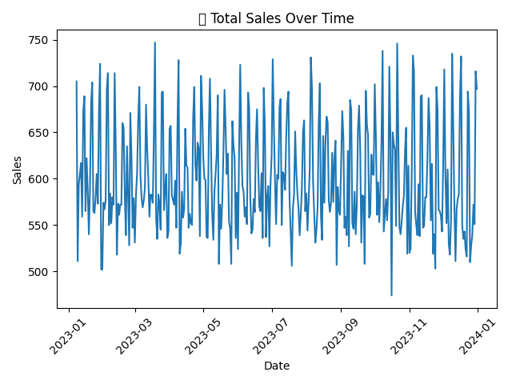
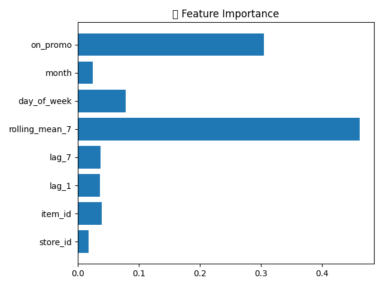
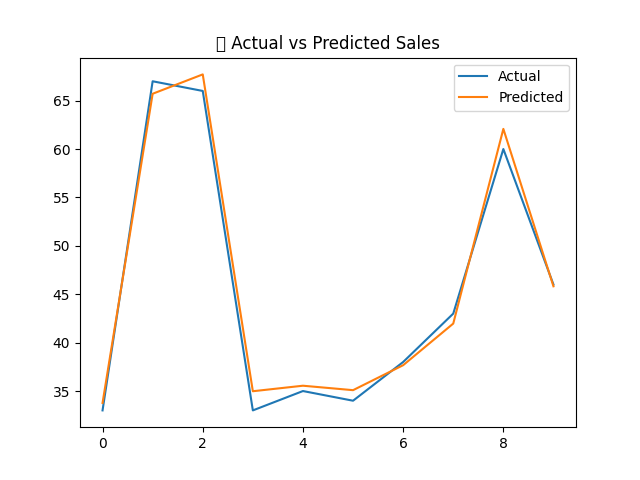

# 📊 Retail Sales Forecasting & Inventory Optimization System

## 🚀 Overview
This project is an end-to-end Retail Analytics system that forecasts future sales and optimizes inventory levels using Machine Learning and business-driven logic.

It simulates how real-world retail companies like Amazon, Walmart, and Flipkart manage demand forecasting and stock planning.

---

## ❗ Problem Statement
Retail businesses often face:
- Overstocking 📦 (extra cost)
- Stockouts ❌ (lost sales)
- Poor demand forecasting 📉

---

## ✅ Solution
This system:
- Predicts future demand using Machine Learning
- Calculates Safety Stock & Reorder Point
- Suggests optimal inventory levels

---

## 🧠 Tech Stack
- Python
- Pandas
- NumPy
- Scikit-learn
- Matplotlib
- Streamlit

---

## ⚙️ Features
- 📈 Sales Forecasting using Random Forest
- 🔧 Feature Engineering (Lag, Rolling Mean)
- 📊 Visualization (Trends, Predictions)
- 📦 Inventory Optimization (Safety Stock, ROP)
- 🌐 Interactive Dashboard (Streamlit)

---
data/
├── retail_data.csv

preprocessing.py
features.py
model.py
inventory.py
visualization.py
main.py
app.py
requirements.txt
README.md

---

## ▶️ How to Run

### 1️⃣ Install Dependencies

pip install -r requirements.txt

### 2️⃣ Run Main Project

python main.py

### 3️⃣ Run Dashboard

streamlit run app.py

---

## 📊 Results

- Model MAE: ~1.6 (high accuracy)
- Accurate demand forecasting
- Optimized inventory decisions
- Reduced stockout risk

---

## 📸 Screenshots

## 💼 Business Impact
- Improves demand planning
- Reduces excess inventory
- Prevents stockouts
- Supports data-driven decision making

---

## 🚀 Future Improvements
- Multi-store forecasting
- Advanced models (XGBoost, LSTM)
- Real-time data integration
- Weather & promotion impact analysis

---

## 👨‍💻 Author
**Jatin Gujarathi**

---

## ⭐ If you like this project
Give it a star ⭐ on GitHub!

## 📁 Project Structure
